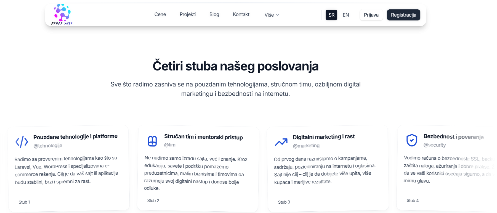

# ProfiSajt.digital Frontend (Vue.js SPA)

## 📖 Opis projekta

Single Page Application (SPA) za projekat **ProfiSajt.digital**, zasnovana na Vue.js + Vite stack-u, sa prilagođenim Cruip šablonom.

Frontend je zadužen za:
- prezentaciju usluga Express Web / ProfiSajt.digital,
- multijezičku podršku (srpski / engleski),
- auth ekrane (registracija, prijava, reset lozinke),
- integraciju sa zasebnim Laravel API backendom (`profisajt-api`).

> Ovaj repozitorijum pokriva **samo frontend deo** (Vue SPA). Backend živi u posebnom projektu `profisajt-api`.

---

## 🔧 Tehnologije

- [Vue 3](https://vuejs.org/) (Composition API, `<script setup>`)
- [Vite](https://vitejs.dev/) – dev server i produkcijski build
- [Tailwind CSS](https://tailwindcss.com/) – stilizacija komponenata
- [Vue Router](https://router.vuejs.org/) – SPA rute
- [vue-i18n](https://vue-i18n.intlify.dev/) – internacionalizacija (sr/en)
- [AOS](https://michalsnik.github.io/aos/) – scroll animacije
- Cruip dizajn šablon kao osnova za layout

---

## 📁 Struktura projekta

Najvažnije putanje:

- `src/App.vue` – ulazna tačka aplikacije, layout switch (default/auth)
- `src/layouts/DefaultLayout.vue` – glavni layout sa Header-om
- `src/layouts/AuthLayout.vue` – layout za /signin, /signup, /reset-password
- `src/partials/Header.vue` – glavna navigacija
- `src/pages` – stranice (Home, SignIn, SignUp, ResetPassword, Terms, Privacy…)
- `src/locales/en.json` – engleski prevodi
- `src/locales/sr.json` – srpski (latinica) prevodi
- `src/assets` – slike (npr. ilustracije, screenshotovi)

---

## 🚀 Instalacija i razvoj

### 1. Kloniranje repozitorijuma

   
git clone https://github.com/Express-Web/profisajt-frontend.git
cd profisajt-frontend
(URL prilagodi kada napraviš pravi Git repo.)

2. Instalacija paketa
npm install
3. Development server
npm run dev

Aplikacija je dostupna na:

http://localhost:5173
(ili na portu koji Vite prijavi u konzoli).

4. Produkcijski build
npm run build

Generisani fajlovi se nalaze u dist/ i spremni su za deploy (npr. na Cloudways / Nginx).

🌐 Konfiguracija okruženja
Osnovne vrednosti mogu se podešavati kroz Vite env fajl:

env

VITE_API_BASE_URL=https://api.profisajt.digital
VITE_APP_DEFAULT_LOCALE=sr
VITE_APP_FALLBACK_LOCALE=en
.env fajl ne ide u Git (dodati u .gitignore), već se postavlja po okruženju (lokal, staging, produkcija).

🔑 Autentifikacija (plan)
Frontend trenutno sadrži:

/signup – registracija korisnika

/signin – prijava korisnika

/reset-password – slanje linka za reset lozinke

Forme su već pripremljene za rad sa API-jem (validacija, stanja loading, poruke).
Sledeći korak je uvezivanje sa Laravel backendom (profisajt-api) preko REST API / Sanctum.

🧩 Zavisnost od Cruip šablona
Ovaj projekat je nastao na osnovu Vue šablona Simple Vue by Cruip i značajno je prilagođen potrebama Express Web / ProfiSajt.digital:

promenjen sadržaj,

dorađeni layouti (DefaultLayout / AuthLayout),

dodat i18n sistem,

pripremljena auth logika za API,

dodat specifičan copy za Express Web.

Originalni Cruip template je korišćen u skladu sa licencom po kojoj je kupljen.
Za sva pitanja vezana za originalni dizajn i osnovni template, pogledati Cruip FAQ:
https://cruip.com/faq/

📄 License / Autorska prava
UI dizajn šablona: © Cruip

Razvoj, modifikacije i programska logika: © Express Web / ProfiSajt.digital

Svi tekstualni i vizuelni materijali su vlasništvo ProfiSajt.digital i zaštićeni su autorskim pravima.

Sva prava zadržana.

## Autor Express Web / ProfiSajt.digital
- Website: https://profisajt.digital
- Email: office{'@'}express-web.express

- Radoje Božić - Frontend&Backend Developer
- Email: radojebozic1966{'@'}gmail.com